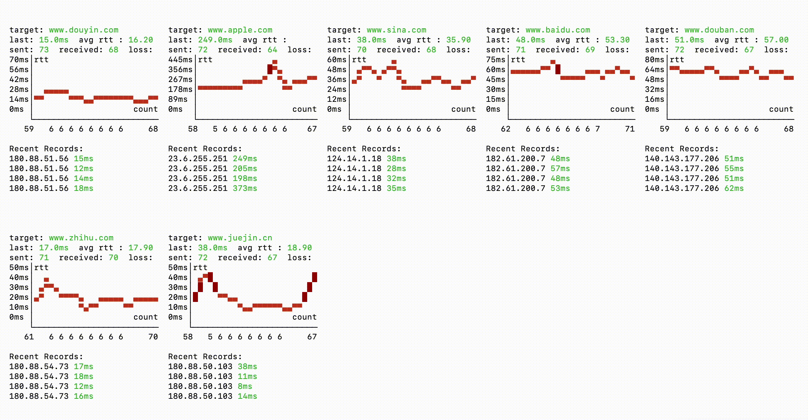
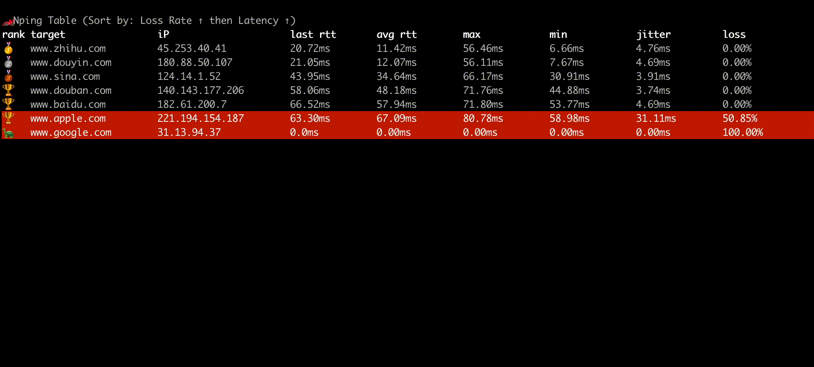

<h1 align="center"> 🏎 Nping </h1>
<p align="center">
    <em>Nping 是一个基于 Rust 开发使用 ICMP 协议的 Ping 工具, 支持多地址并发 Ping, 可视化图表展示, 数据实时更新等特性 </em>
</p>
<p align="center">
    
</p>

<p align="center">
    <a href="https://hellogithub.com/repository/21f5600774554866a3d686308df2dbf0" target="_blank">
        
    </a>
</p>

**白色效果**
<p align="center">
    
</p>

**黑色效果**
<p align="center">
    
</p>

**表格模式w**
<p align="center">
    
</p>

## Installation

#### MacOS Homebrew
```bash
brew tap hanshuaikang/nping
brew install nping

nping --help
```


## Feature:
- 支持多地址并发同时 Ping
- 支持可视化延迟展示
- 实时最大最小平均延迟丢包率等指标展示
- 支持 IpV4 和 IpV6
- 支持一个地址下并发 Ping n 个 ip

## 后续的计划:
- 展示 IP 所属的国家和城市
- 新增 host 子命令, 支持展示该域名所对应的 ip 地址的详细信息。
- UI 界面优化, 增加更多的动态效果
- 当存在多个地址时, 结束时根据平均延迟展示排序

## Usage

```bash
nping www.baidu.com www.google.com www.apple.com www.sina.com -c 20 -i 2

nping --help

🏎 Nping mean NB Ping, A Ping Tool in Rust with Real-Time Data and Visualizations

Usage: nping [OPTIONS] <TARGET>...

Arguments:
  <TARGET>...  target IP address or hostname to ping

Options:
  -c, --count <COUNT>        Number of pings to send [default: 65535]
  -i, --interval <INTERVAL>  Interval in seconds between pings [default: 0]
  -6, --force_ipv6           Force using IPv6
  -m, --multiple <MULTIPLE>  Specify the maximum number of target addresses, Only works on one target address [default: 0]
  -v, --view-type <VIEW_TYPE>  view mode graph or table [default: graph]
  -h, --help                 Print help
  -V, --version              Print version
```

## 致谢
感谢这些朋友对 Nping 提出的反馈和建议。

| [ThatFlower](https://github.com/ThatFlower) | [zx4i](https://github.com/zx4i) | [snail2sky](https://github.com/snail2sky) | [shenshouer](https://github.com/shenshouer) | [vnt-dev](https://github.com/vnt-dev) | [qingyuan0o0](https://github.com/qingyuan0o0)
| [Onlywzr](https://github.com/Onlywzr)

感谢以下自媒体对 Nping 的关注和转发。

| [阮一峰的网络日志](https://www.ruanyifeng.com/blog/weekly/) |[Rust 中文社区](https://rustcc.cn/) | [公众号:奇妙的linux世界](https://mp.weixin.qq.com/s/lK_OqKp2yY8lDBoyLxtdGA) | [公众号:IT运维技术圈](https://mp.weixin.qq.com/s/bDJZ-H02dIKG3R7LQCeyaQ)
| [X:@geekbb](https://x.com/geekbb/status/1875754541905539510) | [公众号:一飞开源](https://mp.weixin.qq.com/s/BZjr54h8dIQgzr8UW3fwOQ)

## Star History
[](https://star-history.com/#hanshuaikang/Nping&Date)